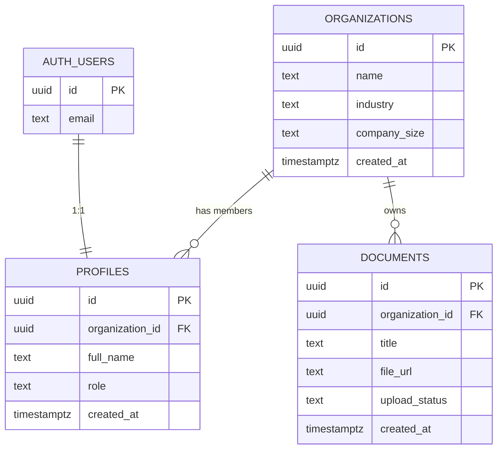

# Database ER Diagram — Phase 1

```mermaid
erDiagram
  ORGANIZATIONS ||--o{ PROFILES : "has members"
  ORGANIZATIONS ||--o{ DOCUMENTS : "owns"
  AUTH_USERS ||--|| PROFILES : "1:1"

  ORGANIZATIONS {
    uuid id PK
    text name
    text industry
    text company_size
    timestamptz created_at
  }

  PROFILES {
    uuid id PK
    uuid organization_id FK
    text full_name
    text role
    timestamptz created_at
  }

  DOCUMENTS {
    uuid id PK
    uuid organization_id FK
    text title
    text file_url
    text upload_status
    timestamptz created_at
  }

  AUTH_USERS {
    uuid id PK
    text email
  }
```
