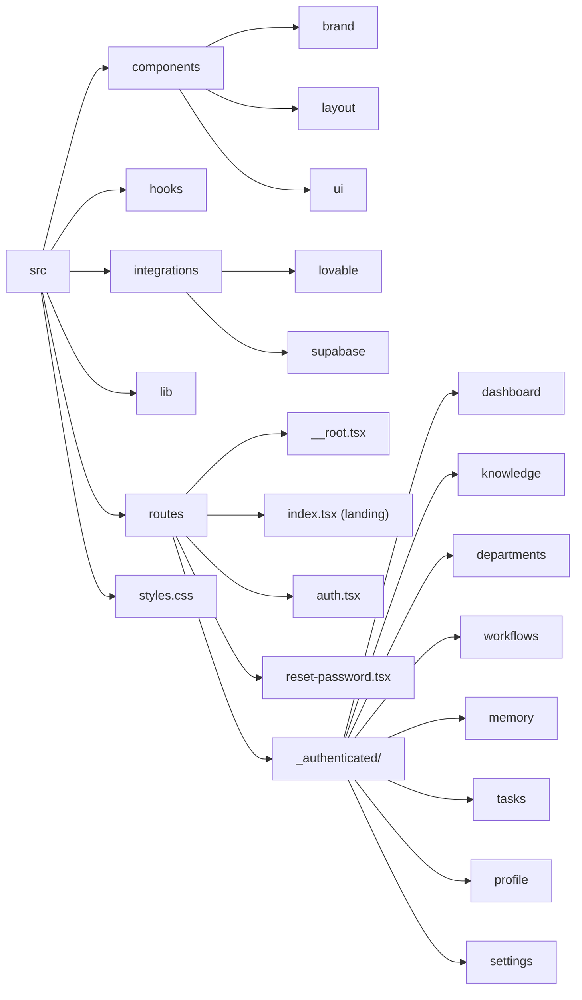

# Folder Structure Diagram

```mermaid
graph LR
  src --> components
  src --> hooks
  src --> integrations
  src --> lib
  src --> routes
  src --> styles.css

  components --> brand
  components --> layout
  components --> ui

  integrations --> lovable
  integrations --> supabase

  routes --> root["__root.tsx"]
  routes --> index["index.tsx (landing)"]
  routes --> auth["auth.tsx"]
  routes --> reset["reset-password.tsx"]
  routes --> authd["_authenticated/"]

  authd --> dash[dashboard]
  authd --> know[knowledge]
  authd --> dept[departments]
  authd --> wf[workflows]
  authd --> mem[memory]
  authd --> tasks[tasks]
  authd --> profile[profile]
  authd --> settings[settings]
```
