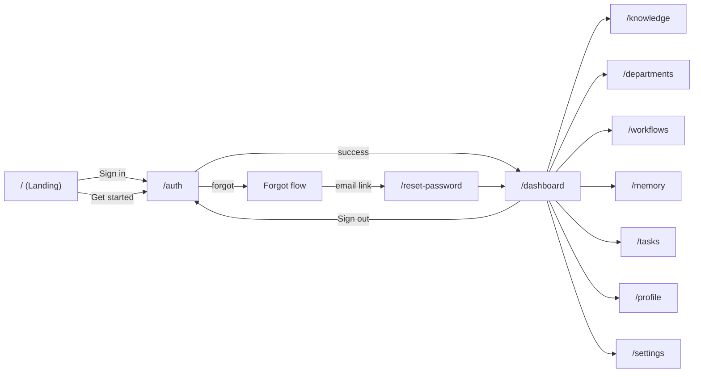

# Navigation Flow

```mermaid
flowchart LR
  Landing["/ (Landing)"] -->|Sign in| Auth["/auth"]
  Landing -->|Get started| Auth
  Auth -->|success| Dashboard["/dashboard"]
  Auth -->|forgot| Forgot[Forgot flow]
  Forgot -->|email link| Reset["/reset-password"]
  Reset --> Dashboard

  Dashboard --> Knowledge["/knowledge"]
  Dashboard --> Departments["/departments"]
  Dashboard --> Workflows["/workflows"]
  Dashboard --> Memory["/memory"]
  Dashboard --> Tasks["/tasks"]
  Dashboard --> Profile["/profile"]
  Dashboard --> Settings["/settings"]

  Dashboard -->|Sign out| Auth
```
