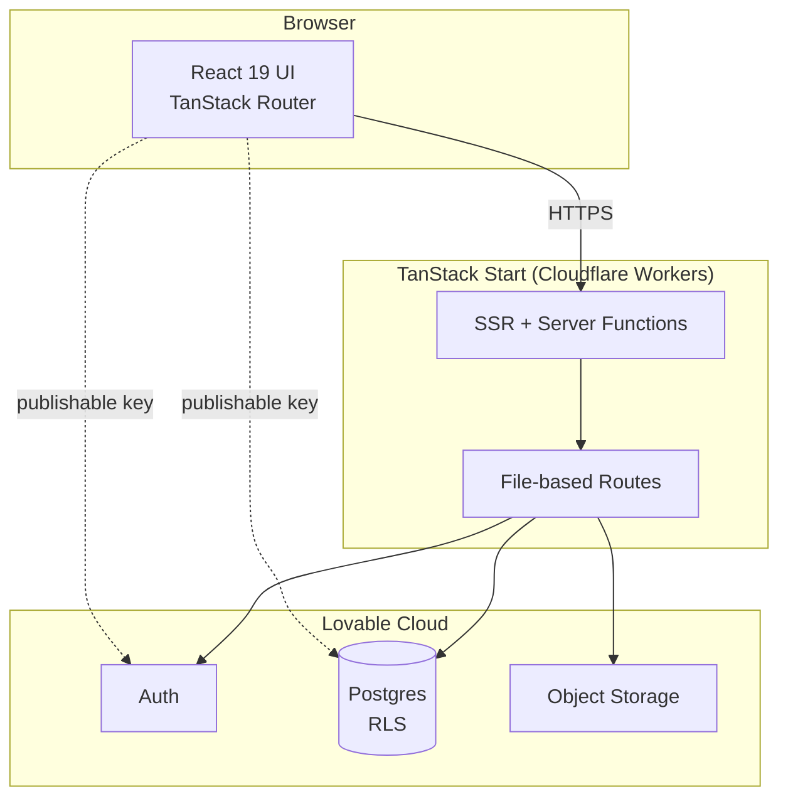

# System Architecture Diagram

```mermaid
flowchart TB
  subgraph Browser
    UI[React 19 UI<br/>TanStack Router]
  end
  subgraph Edge["TanStack Start (Cloudflare Workers)"]
    SSR[SSR + Server Functions]
    Routes[File-based Routes]
  end
  subgraph Cloud["Lovable Cloud"]
    Auth[Auth]
    DB[(Postgres<br/>RLS)]
    Storage[Object Storage]
  end

  UI -->|HTTPS| SSR
  SSR --> Routes
  Routes --> Auth
  Routes --> DB
  Routes --> Storage
  UI -.->|publishable key| Auth
  UI -.->|publishable key| DB
```
